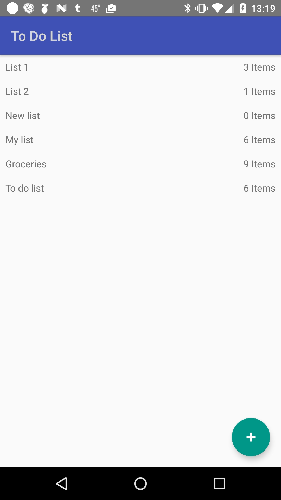
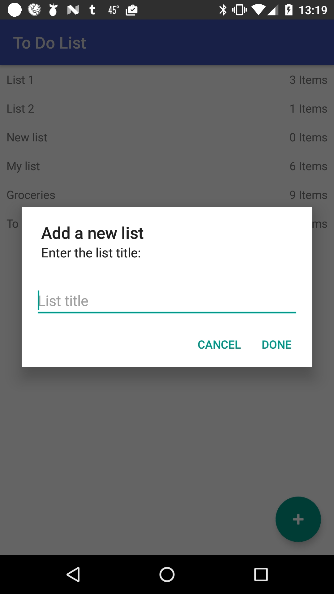
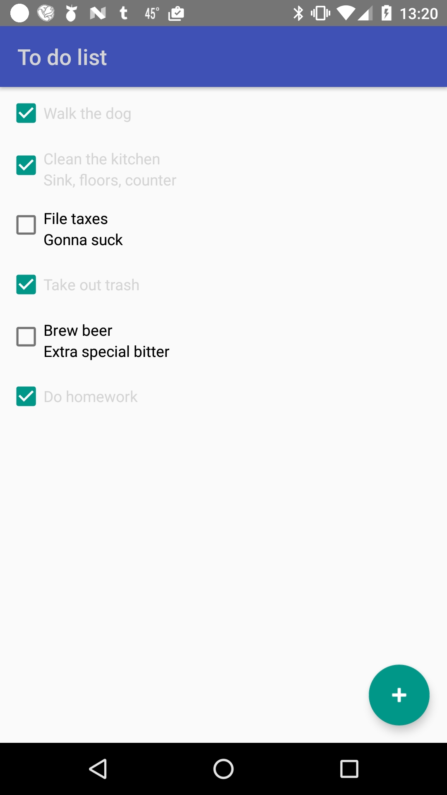
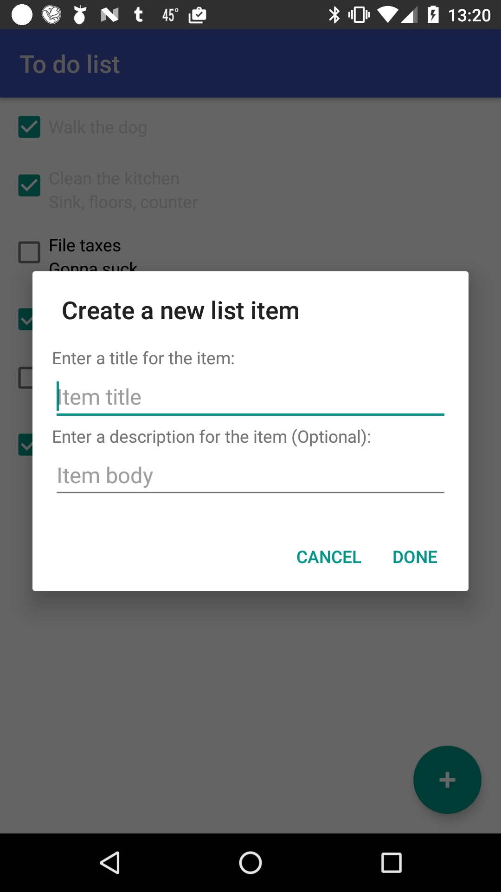
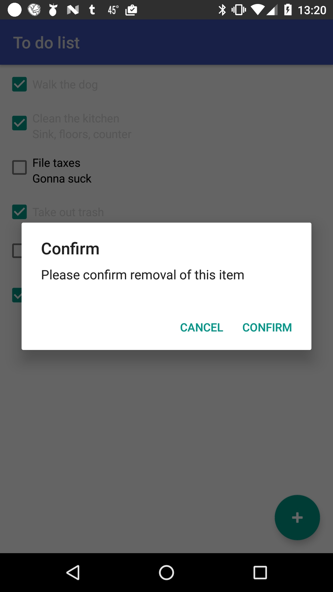

#  Project #1: To-Do List

#### Overview

The app created for this project is a simple to-do list utility. The user can add and remove lists containing to-do items, which can be added or removed from each list.

---

#### Functionality

The app opens to an empty list of to-do lists with a floating action button. Clicking the button brings up an Alert Dialog with an edittext asking for a title for a new list. The Done button cannot be successfull clicked until a value is entered into the textview. If no value is entered, an error is displayed and the text field takes focus. Once a valid value is entered a new list is created and the to-do list activity is launched. If a to-do list is long clicked in the main activity, a dialog is displayed asking the user to confirm removing the list. Each list item on this screen also displays the number of items in the to-do list.

The to-do list activity displays the list name at the top of the screen. A new to-do list is initially empty. Clicking the floating action button opens an Alert Dialog with two EditText fields, one for a new item title and one for a new item description. The new title is required, while the description is optional. Entering just a title creates a new to-do item that features a CheckBox with one TextView, while entering both a title and description creates a new to-do item with a CheckBox and two TextViews, one for the title, and one for the description. Clicking an existing to-do item brings up an edit window in which the user can update the title and/or description, based on the type of item it is. Long clicking the item brings up an alert asking the user to confirm the deletion of the item.

For testing purposes, the floating action button on each activity has a long-click listener that adds a default template item to the list.

---

#### Known Bugs

- In an opened to-do list, when returning from creating a new list item in landscape orientation, the new item does not show until the device is put back into portrain orientation.

---

#### ScreenShots

  
  
  
  
  

